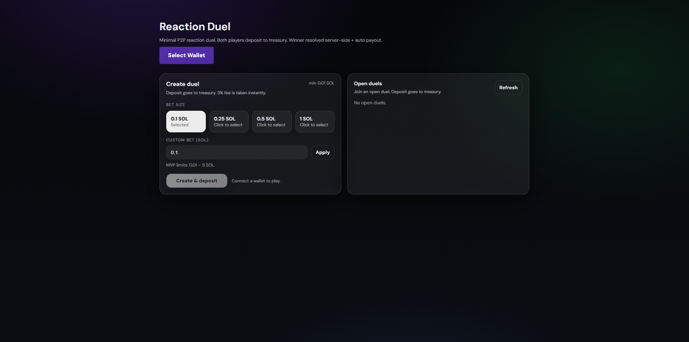

# Reaction Duel ⚡

Minimal PvP reaction game built on Solana.

Speed. Fairness. Minimal surface area.

## Live

https://reaction-duel.vercel.app/




---

## Overview

Reaction Duel is a real-time player-versus-player reaction game.

Two players enter a duel.
A random signal appears.
The fastest valid click wins.

The focus is simplicity:

- Clear mechanics
- Competitive fairness
- Minimal latency
- Clean state handling

No unnecessary abstractions.
No over-engineering.

---

## Features

- PvP reaction-based gameplay
- Real-time duel flow
- Phantom wallet integration
- Instant result resolution
- Clean minimal UI
- Fast round resets

---

## How It Works

1. Player creates or joins a duel
2. Both players wait for the random signal
3. Signal appears
4. First valid click wins
5. Result is displayed immediately

Flow:

Client → Wallet → Game state → Result resolution → UI update

---

## Stack

- Next.js
- TypeScript
- Solana Web3.js
- Vercel

---

## Run Locally

```bash
npm install
npm run dev
